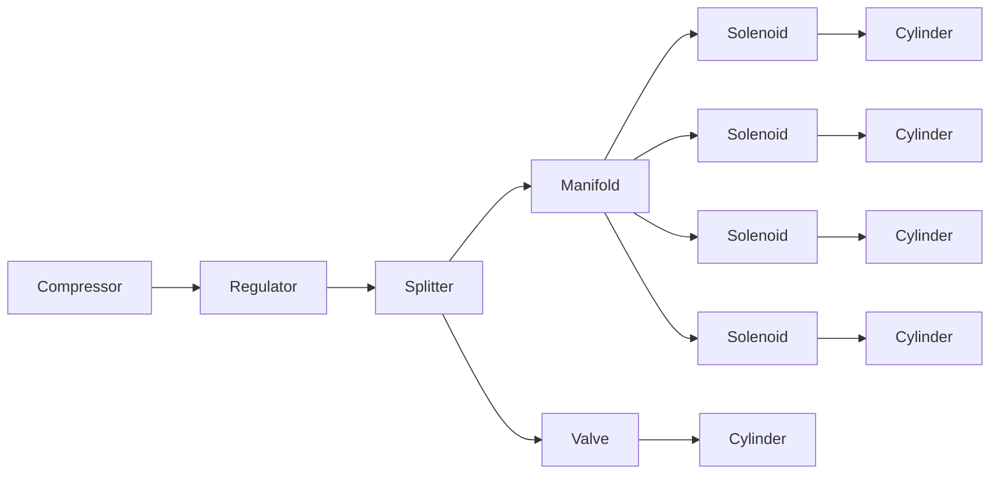

# playful-pneumatics
Sometimes Air >Electricity

# A Pneumatics Primer for Makers

## Overview
A typical pneumatic system consists of the following components:
 - Compressor
 - Accumulator
 - Regulator
 - Tubing, Adaptors, Splitters and Manifolds
 - Solenoid Valves
 - Cylinders

And the following diagram illustrated a high-level oveview of how these might be connected together

#### Compressor
This is the "power source" of your pneumatic system. Every component will need to be connected to the compressor, and air will flow from it through connected tubing, in much the same way that current flows through an electrical circuit when connected to a battery.

#### Accumulator
This is an optional component that you can use to store a reservoir of pressurised air from the compressor. It acts in a similar way to a capacitor in an electrical circuit, providing a ready source of compressed air when a prop demands it.

#### Regulator
A regulator is an adjustable valve that can be used to limit the pressure in certain sections of the pipe. They are somewhat similar to resistors in an electrical circuit. 

#### Tubing
Like wires, pneumatic tubing is available in a variety of diameters. Larger diameter pipes carry a greater volume of air, but will drain your reservoir faster. PolyethylPolyethylene will kink if you squeeze it too hard so you won't be able to route it around tight corners. For that, use a dedicated 90' bend connector. Polyurethane is more expensive but does not kink.

#### Connectors
I recommend using push-fit connectors. You need to purchase push-fit connectors that match the diameter of the tubing you're using. I'm using 8mm tubing throughout. The other side of the connector will need to match the thread of the component you're connecting to. This is normally a 1/4", but sometimes 1/8". The compressor itself probably has one of these Euro-style push connectors. Don't use barbed connectors - they simply ping off under high pressure.

#### Splitters
These very simply allow one air input (from your compressor) to be directed to multiple outputs

#### Solenoid Valves
A solenoid valve is an electronically-operated switch, much like a relay in an electronic circuit. There are various sorts (discussed in more detail below), but all allow you to direct flow of air to different sections of pipework

#### Manifold 
A manifold is a solid block (usually made of machined aluminium) that acts as a splitter, combined with a solenoid valve controlling each output. It is somewhat like a 4-channel relay

#### Cylinder
Cylinders are the most common sort of pneumatic output, creating linear movement to expand/contract when air pressure is applied at the port(s). They are similar to electronic linear actuators. 

## Compressors

Compressors are the "power source" of any pneumatic system. They use an electric motor to draw in air and compress it into a storage tank, increasing its pressure. 
When the pressure in the tank reaches its set upper limit, the compressor automatically shuts off, but the stored air in the tank remains pressurised, and can be directed through a connected network of tubes to any attached devices. You can attach several devices to a single compressor, using splitters.
As the air in the tank is depleted, the compressor turns on again and re-pressurizes back to the target pressure again.

Relevant specifications for compressors:

 - **Pressure (psi)**: This is the amount of pressure the compressor can generate. Pressure can be measured in various units: Typical values might be 100psi ≈ 7 bar = 700kPa = 0.7MPa. However, you do not need to run all connected devices at the same pressure - regulators can be added to set different pressures at different parts of the circuit. Most props require a minimum psi to operate, but also a stated maximum that you should not exceed; these values typically lie in the range 20 to 100psi. Setting pressure too high will add stress to the mechanism and reduce lifetime of the prop.
 - **Volume Flow Rate (cfm / l/min)**: This is the volume of air that the compressor can deliver in one minute. A typical value might be 120 litres/min ≈ 4 cubic feet/min (cfm). Compressors with a higher flow rate also typically have a larger tank size. A compressor with a larger cfm will be able to supply air to more concurrent props.
 - **Tank Size (litres / gallons)**: The larger the air holding tank the less the compressor has to work because there will be more air available at all times. A tank of 20 litres ≈ 5 gallons is suitable for most escape room usage of around five simultaneous props, but it never hurts to get a compressor with a larger tank if possible.
 - **Power: (W / hp)**: The power of the motor that compresses the air. Typical values might be 750W ≈ 1hp. A more powerful motor will be able to repressurise the tank more quickly, and keep up with multiple props firing.

As an example of a good, relatively inexpensive, compact compressor: https://www.amazon.co.uk/Hyundai-Electric-Compressor-Release-Fittings/dp/B07TJQZLSF

## Valve Types
| Description | Ports | Usage |
| --- | --- | --- |
| 2-port, 2-way | Inlet, Outlet | One-way only, "shut-off" valve. Can expel air only, which can be used for effects (e.g. air cannons), but not useful for cylinders |
| 3-port, 3-way | Inlet, Outlet, Exhaust | Outlet port is normally connected to exhaust, but switches to inlet when activated (similar to an electronic relay switching the C terminal from NC to NO). When connected to exhaust, allows air to escape, but does not actively "pull" cylinder back to initial position, so it needs to be reset under force of gravity, or via a spring |
| 4-port, 4-way | Inlet, Outlet1, Outlet2, Exhaust | Used for "push-pull" operation of dual cylinders. |
| 5-port, 4-way | Inlet, Outlet1, Exhaust1, Outlet2, Exhaust2 | Used for "push-pull" operation of dual cylinders, but with separate exhausts allow for separate rate of extension / contraction |
